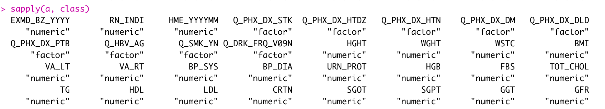
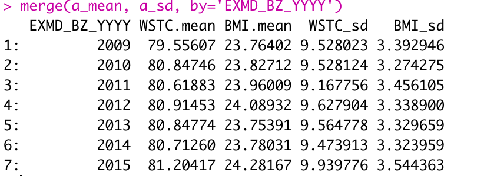

# 2022년 2학기 R을활용한보건의료자료분석론 (CSP5044_41) 
> 2021712538 정영민

## 중간고사

```
biohrs_YM
├── result_Q1.png
├── result_Q2.png
├── biohrs_YM.Rproj
├── git_config.R
├── midterm.R
├── midterm.Rproj
└── plot_file.pptx
```

**midterm.R**: 실행 코드  
**result_Q1.png**: Q1 의 결과  

**result_Q2.png**: Q2 의 결과  
  
**plot_file.pptx**: Q3의 결과 plot

